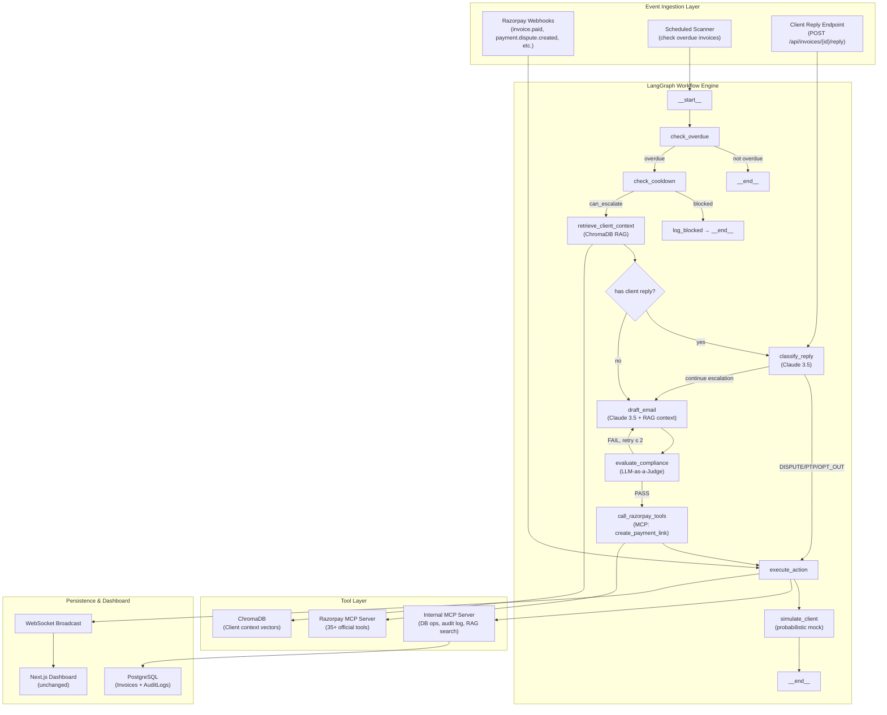

# RevenueGuard v2 — Final Implementation Plan

> **Status:** FINAL — Awaiting user approval before execution  
> **LLM Provider:** Anthropic Claude 3.5 Sonnet (`claude-3-5-sonnet-20241022`)  
> **RAG Strategy:** Handcrafted client scenarios for live demo  
> **Reference Document:** [project_core_context.md](file:///C:/Users/abhin/.gemini/antigravity/brain/44ca47e4-6098-4598-b6ea-caf110cc4993/project_core_context.md)

---

## 1. What We Are Building (Executive Summary)

We are upgrading the existing `v2_b2b` codebase from a manually-orchestrated Python script into a **true agentic AI system** by integrating three core technologies:

| Technology | Role | Analogy |
|---|---|---|
| **LangGraph** | Workflow orchestration — the agent's "brain" | A flowchart engine that decides what step to take next |
| **Razorpay MCP Server** | Tool access — the agent's "hands" | A USB port that lets the AI call Razorpay APIs directly |
| **RAG (ChromaDB)** | Context memory — the agent's "memory" | A filing cabinet the AI searches before writing emails |

**The end result:** An AI agent that can autonomously detect overdue B2B invoices, retrieve client history, draft contextual escalation emails, self-check compliance, generate Razorpay Payment Links or Virtual Bank Account details, and halt when it detects disputes, promises, or opt-outs — all while logging every decision to a transparent audit trail.

---

## 2. Concepts Explained (For Someone New to Agentic AI)

### 2.1 What is LangGraph?

Right now, your agent's decision-making lives in [core_loop.py](file:///c:/PROGRAMER's%20FOLDER/Projects/RazorPay/RevenueGuard/v2_b2b/src/engine/core_loop.py) as a series of `if/elif` blocks. LangGraph replaces that with a **stateful graph** where:

- Each **node** is one step of reasoning (e.g., "Classify the client's reply", "Draft an email", "Check compliance")
- Each **edge** is a conditional transition (e.g., "If intent == DISPUTE → go to Halt node")
- The **state** (invoice data, agent reasoning, drafted email) flows automatically between nodes
- The graph supports **cycles** — the "Draft → Judge → Rewrite → Judge again" compliance loop is trivial in LangGraph but painful with `if/elif`
- It supports **checkpointing** — if the server crashes mid-workflow, it resumes from the last node

### 2.2 What is an MCP Server?

MCP (Model Context Protocol) is an open standard that defines **how an AI agent connects to external tools**. Instead of you writing Python code for every Razorpay API call, the agent is given a list of "tools" it can call. The agent decides *which* tool to use and *when*.

**Razorpay provides an official MCP server** with 35+ pre-built tools. We connect our LangGraph agent to it, and the agent can natively:
- Create Payment Links (`create_payment_link`)
- Fetch payment status (`fetch_payment_by_id`)
- Resend payment notifications (`resend_payment_link_notification`)
- And 30+ more operations

We also build a **small custom MCP server** for our own internal database operations (update invoice status, log audit events, search RAG).

### 2.3 What is RAG?

RAG (Retrieval-Augmented Generation) is a technique where the LLM **looks up relevant information** before generating a response. Instead of the agent knowing only "Invoice is overdue for ₹12,50,000", it retrieves:

```
- Contract terms: Net-60 payment terms (so this invoice isn't actually overdue yet!)
- Past behavior: Acme Corp has paid 3 invoices on time, 1 was 10 days late
- Last interaction: Client mentioned "budget cycle ends in Q3" on Aug 15
- Key contact: Rajesh Kumar, Finance Manager. Prefers email.
```

This makes the drafted emails dramatically more contextual and human-like — the single biggest "wow factor" for judges.

### 2.4 What is LLM-as-a-Judge?

A **multi-agent pattern** where two LLMs work together:
- **Agent 1 (The Drafter):** Writes the email
- **Agent 2 (The Compliance Judge):** Reviews the draft against a strict rubric (no legal threats, correct tone for escalation stage, payment link included). If it fails, Agent 2 kicks it back to Agent 1 for a rewrite.

This directly hits the **"Compliant Escalation"** pillar from the judging criteria.

---

## 3. Razorpay APIs We Will Use

> [!IMPORTANT]
> This section documents every Razorpay feature relevant to our project, discovered from the official `llms.txt` index. We are NOT reinventing any wheel — we use Razorpay's built-in capabilities wherever possible.

### 3.1 Tier 1 — Core (Must Have for Demo)

#### Razorpay MCP Server (Our Agent's Tool Layer)
- **Remote endpoint:** `https://mcp.razorpay.com/mcp` with `Authorization: Basic <base64(KEY_ID:KEY_SECRET)>`
- **Local Docker alternative:** `npx @razorpay/mcp-server` with env vars `RAZORPAY_KEY_ID` and `RAZORPAY_KEY_SECRET`
- **Docs:** [MCP Server Overview](https://razorpay.com/docs/build/llm-docs/mcp-server.md) · [Tools Reference](https://razorpay.com/docs/build/llm-docs/mcp-server/tools-reference.md) · [Local Setup](https://razorpay.com/docs/build/llm-docs/mcp-server/local.md) · [Use Cases](https://razorpay.com/docs/build/llm-docs/mcp-server/use-cases.md)
- **Key tools we'll use:** `create_payment_link`, `fetch_payment_link_by_id`, `update_payment_link`, `cancel_payment_link`, `resend_payment_link_notification`, `fetch_payment_by_id`, `create_order`
- **Why:** Eliminates the need to write low-level REST API wrappers. The LangGraph agent calls these tools natively via Claude's tool-use capability.

#### Invoices API (Our Core Domain Entity)
- **Docs:** [Overview](https://razorpay.com/docs/build/llm-docs/payments/invoices.md) · [API Reference](https://razorpay.com/docs/build/llm-docs/api/payments/invoices.md) · [States](https://razorpay.com/docs/build/llm-docs/payments/invoices/states.md) · [Resend](https://razorpay.com/docs/build/llm-docs/api/payments/invoices/resend.md) · [Webhooks](https://razorpay.com/docs/build/llm-docs/webhooks/invoices.md)
- **Invoice States:** `draft` → `issued` → `partially_paid` / `paid` / `cancelled` / `expired`
- **Why:** The agent monitors invoices transitioning to `expired` state or where `current_timestamp > expire_by` with status `issued`. The `resend` endpoint triggers official Razorpay notification emails/SMS.

#### Payment Links API (The Payment Vehicle in Every Email)
- **Docs:** [Overview](https://razorpay.com/docs/build/llm-docs/payments/payment-links.md) · [API Reference](https://razorpay.com/docs/build/llm-docs/api/payments/payment-links.md) · [Partial Payments](https://razorpay.com/docs/build/llm-docs/payments/payment-links/partial-payments.md) · [Reminders](https://razorpay.com/docs/build/llm-docs/payments/payment-links/reminders.md) · [Webhooks](https://razorpay.com/docs/build/llm-docs/webhooks/payment-links.md) · [Retry Links](https://razorpay.com/docs/build/llm-docs/payments/payment-links/announcements/retry-link.md)
- **Why:**
  - **PTP Deadline Enforcement:** When a debtor commits ("We will pay by Friday"), the agent generates a Payment Link with `expire_by` set to the exact promised timestamp.
  - **Partial Recovery:** By enabling `partial_payment: true` and `first_min_partial_amount`, the agent accepts negotiated installments.
  - **Retry Links:** When a debtor clicks a link but payment fails (network drop, OTP timeout), Razorpay generates a Retry Link. The agent dispatches an immediate follow-up: "We noticed your payment attempt was interrupted."

#### Webhooks (Reactive Triggers & Stopping Rules)
- **Docs:** [Overview](https://razorpay.com/docs/build/llm-docs/webhooks.md) · [All Events](https://razorpay.com/docs/build/llm-docs/webhooks/all.md) · [Best Practices](https://razorpay.com/docs/build/llm-docs/webhooks/best-practices.md) · [Validation](https://razorpay.com/docs/build/llm-docs/webhooks/validate-test.md)
- **Critical webhook events:**

| Event | Triggers | Maps to Project Core Context |
|---|---|---|
| `invoice.paid` | Invoice fully paid | **Stop Condition 1** — Payment Received → `RECOVERED` |
| `invoice.partially_paid` | Partial payment received | Log partial recovery, continue chasing remainder |
| `payment_link.paid` | Payment Link clicked and paid | **Stop Condition 1** → `RECOVERED` |
| `payment_link.expired` | Link expired without payment | Resume escalation or generate new link |
| `virtual_account.credited` | NEFT/RTGS received in Virtual Account | **Stop Condition 1** → `RECOVERED` |
| `payment.dispute.created` | Client filed a formal bank dispute | **Stop Condition 3** — Dispute → `DISPUTED` → halt all automation |
| `payment.failed` | Payment attempt failed | Agent sends a "payment assistance" email, not a harsh reminder |
| `settlement.processed` | Funds settled to merchant bank | Proof for Pillar 1: "₹X has actually cleared into the treasury" |

### 3.2 Tier 2 — High Impact (Differentiators)

#### Smart Collect / Virtual Accounts (B2B Bank Transfer Rail)
- **Docs:** [Overview](https://razorpay.com/docs/build/llm-docs/payments/smart-collect.md) · [API Reference](https://razorpay.com/docs/build/llm-docs/api/payments/smart-collect.md) · [Smart Collect 2.0](https://razorpay.com/docs/build/llm-docs/api/payments/smart-collect-2.md) · [UTR Fetch](https://razorpay.com/docs/build/llm-docs/api/payments/smart-collect/fetch-payments-bank-transfer-utr.md) · [Webhooks](https://razorpay.com/docs/build/llm-docs/webhooks/smart-collect.md)
- **Why:** Enterprises don't pay ₹50,00,000 via credit card. They wire via NEFT/RTGS. Smart Collect generates a unique Virtual Account (with account number + IFSC). The agent includes these details in the collection email: *"Please wire funds to A/C: RAZRXXXXXXXX, IFSC: RAZR0000001."*
- **UTR Verification:** When a debtor replies "Payment processed, UTR is ICIC00098765432", the agent calls `fetch-payments-bank-transfer-utr` to confirm whether funds actually landed before closing the ticket.

#### Customers API (Behavioral Risk Scoring)
- **Docs:** [Overview](https://razorpay.com/docs/build/llm-docs/payments/customers.md) · [API Reference](https://razorpay.com/docs/build/llm-docs/api/customers.md) · [Payment History](https://razorpay.com/docs/build/llm-docs/api/payments/customer-payment-history.md)
- **Why:** The agent inspects `customer-payment-history`. A debtor who consistently pays after 2 gentle nudges gets a patient, courteous tone. A habitual defaulter receives faster escalation. This feeds directly into the RAG context.

#### Disputes API (Stop Condition 3)
- **Docs:** [Overview](https://razorpay.com/docs/build/llm-docs/payments/disputes.md) · [API Reference](https://razorpay.com/docs/build/llm-docs/api/disputes.md) · [Contest](https://razorpay.com/docs/build/llm-docs/api/disputes/contest.md) · [Documents API](https://razorpay.com/docs/build/llm-docs/api/documents.md)
- **Why:** When a client raises a dispute, the agent immediately halts all collection activity, marks invoice as `DISPUTED`, and prepares a representment package (invoice PDF, delivery receipt, signed agreement) using the Documents API.

### 3.3 Tier 3 — Bonus (If Time Permits)

| Feature | Docs | Value for Demo |
|---|---|---|
| **Recurring Payments / e-Mandate** | [Overview](https://razorpay.com/docs/build/llm-docs/payments/recurring-payments.md) · [e-Mandate](https://razorpay.com/docs/build/llm-docs/payments/recurring-payments/emandate/apis.md) | When a debtor agrees to pay in weekly installments, the agent dispatches an e-Mandate authorization link. Once authenticated, the system executes future deductions automatically — transforming an unreliable promise into an automated bank debit. |
| **Dynamic Convenience Fees** | [Overview](https://razorpay.com/docs/build/llm-docs/payments/dynamic-convenience-fees.md) · [API](https://razorpay.com/docs/build/llm-docs/payments/dynamic-convenience-fees/api.md) | Under MSMED Act, overdue invoices legally accrue interest. The agent can calculate and apply late fees dynamically. |
| **Third Party Validation (TPV)** | [Overview](https://razorpay.com/docs/build/llm-docs/payments/third-party-validation.md) · [Smart Collect TPV](https://razorpay.com/docs/build/llm-docs/api/payments/smart-collect-tpv.md) | Ensures funds received come from the debtor's verified corporate account only — prevents money laundering risk. |
| **Settlements Recon** | [API](https://razorpay.com/docs/build/llm-docs/api/settlements/fetch-recon.md) · [Webhooks](https://razorpay.com/docs/build/llm-docs/webhooks/settlements.md) | Proves that recovered amounts have actually cleared into the corporate treasury — not just theoretical recoveries. |
| **Items API** | [Overview](https://razorpay.com/docs/build/llm-docs/payments/invoices/items.md) · [API](https://razorpay.com/docs/build/llm-docs/api/payments/invoices/create-item.md) | Enables partial dispute triage: "We accept Milestone 1 but dispute Milestone 2" → agent issues immediate link for the undisputed line item. |
| **WhatsApp Business** | [Integration](https://razorpay.com/docs/build/llm-docs/payments/whatsapp.md) · [Bot](https://razorpay.com/docs/build/llm-docs/payments/payment-links/whatsapp-bot.md) | Stage 3+ escalation channel — high-urgency WhatsApp notification with embedded payment link. |

---

## 4. Proposed Architecture



---

## 5. Proposed Changes (File-by-File)

### Phase 1: LangGraph Integration (The Workflow Engine)

> Replace the manual `if/elif` state machine with a LangGraph StateGraph.

---

#### [MODIFY] [requirements.txt](file:///c:/PROGRAMER's%20FOLDER/Projects/RazorPay/RevenueGuard/v2_b2b/requirements.txt)

```diff
 openai>=1.14.0
+anthropic>=0.34.0
+langchain>=0.3.0
+langchain-anthropic>=0.2.0
+langgraph>=0.2.0
+chromadb>=0.5.0
+mcp[cli]>=1.0.0
 sqlalchemy>=2.0.29
 pydantic>=2.7.0
 pydantic-settings>=2.2.1
```

---

#### [NEW] `src/graph/__init__.py`
Empty init file.

#### [NEW] `src/graph/state.py` — The Graph State Schema

The TypedDict that flows through every node. This is the agent's working memory for a single invoice.

```python
from typing import TypedDict, Optional, List
from datetime import datetime

class RecoveryState(TypedDict):
    # Invoice context
    invoice_id: int
    client_name: str
    client_email: str
    amount: float
    due_date: str
    current_status: str
    days_overdue: int
    escalation_stage: str            # STAGE_1, STAGE_2, STAGE_3, STAGE_4

    # Client reply (if any)
    client_reply: Optional[str]

    # Agent working memory
    classified_intent: Optional[str]  # PROMISE_TO_PAY, DISPUTE, OPT_OUT, etc.
    intent_confidence: Optional[float]
    extracted_entities: Optional[dict] # promised_date, disputed_amount, reason

    # RAG-retrieved context
    retrieved_context: Optional[str]  # Contract terms, past interactions, notes

    # Draft & Compliance loop
    drafted_email: Optional[str]
    compliance_verdict: Optional[str] # PASS or FAIL
    compliance_reason: Optional[str]
    compliance_retries: int           # Max 2 rewrites

    # Razorpay tool results
    payment_link_url: Optional[str]   # Generated by MCP create_payment_link
    virtual_account_details: Optional[dict]  # From Smart Collect

    # Execution
    action_taken: Optional[str]
    new_status: Optional[str]
    rule_applied: Optional[str]       # Which compliance rule governed the decision

    # Audit accumulator
    audit_entries: List[dict]

    # Flow control
    should_send_email: bool
```

---

#### [NEW] `src/graph/nodes.py` — The Graph Nodes

Each function receives `RecoveryState`, does one thing, returns the updated state.

| Node | Purpose | Maps to existing code |
|---|---|---|
| `check_overdue` | Is invoice past due date? | Lines 28-32 of `core_loop.py` |
| `check_cooldown` | 4-day email cooldown rule | Lines 17-25 of `core_loop.py` |
| `retrieve_client_context` | **NEW** — RAG lookup in ChromaDB | Does not exist yet |
| `classify_reply` | Claude 3.5 intent classifier | `classify_client_intent()` in `llm.py` |
| `draft_email` | Claude 3.5 email drafter with RAG context | `draft_escalation_email()` in `llm.py` |
| `evaluate_compliance` | **NEW** — LLM-as-a-Judge reviews the draft | Does not exist yet |
| `call_razorpay_tools` | **NEW** — Creates Payment Link or Virtual Account via MCP | Does not exist yet |
| `execute_action` | Commits DB state change + audit logs | `invoice.status = ...` in `core_loop.py` |
| `simulate_client` | Probabilistic mock behavior | `simulate_client_behavior()` in `core_loop.py` |

---

#### [NEW] `src/graph/edges.py` — Conditional Routing

```python
def route_after_overdue(state: RecoveryState) -> str:
    if state["days_overdue"] <= 0:
        return "__end__"
    return "check_cooldown"

def route_after_cooldown(state: RecoveryState) -> str:
    if not state["should_send_email"]:
        return "log_blocked"
    return "retrieve_client_context"

def route_after_classification(state: RecoveryState) -> str:
    intent = state["classified_intent"]
    if intent in ("PROMISE_TO_PAY", "DISPUTE", "OPT_OUT", "LEGAL_THREAT"):
        return "execute_action"    # Halt — no email needed
    return "draft_email"           # Continue escalation

def route_after_compliance(state: RecoveryState) -> str:
    if state["compliance_verdict"] == "PASS":
        return "call_razorpay_tools"
    if state["compliance_retries"] >= 2:
        return "execute_action"    # Give up after 2 rewrites, log failure
    return "draft_email"           # Rewrite with Judge's feedback
```

---

#### [NEW] `src/graph/builder.py` — Graph Assembly & Compilation

Assembles all nodes and edges into a compiled `StateGraph`. Exports a single `compiled_graph` object that `core_loop.py` invokes.

---

#### [MODIFY] [core_loop.py](file:///c:/PROGRAMER's%20FOLDER/Projects/RazorPay/RevenueGuard/v2_b2b/src/engine/core_loop.py)

**Major rewrite.** The 108-line `if/elif` chain is replaced with:
1. Fetch actionable invoices from DB (same query as before)
2. For each invoice, build a `RecoveryState` dict
3. Invoke `compiled_graph.ainvoke(state)`
4. Read the output state, commit DB changes, broadcast via WebSocket

The `simulate_client_behavior()` moves into `src/graph/nodes.py` as a graph node.

---

### Phase 2: MCP Integration (The Tool Layer)

#### Razorpay Official MCP Server

We connect to Razorpay's **Remote MCP Server** (zero infrastructure needed):

```
Endpoint: https://mcp.razorpay.com/mcp
Auth: Authorization: Basic <base64(RAZORPAY_KEY_ID:RAZORPAY_KEY_SECRET)>
```

This is configured in the LangGraph node `call_razorpay_tools`, which uses `langchain`'s MCP client to:
1. Call `create_payment_link` with the invoice amount, debtor email, and expiry date
2. Receive the payment link URL
3. Inject it into the drafted email before sending

#### [NEW] `src/mcp_server/__init__.py`
Empty init file.

#### [NEW] `src/mcp_server/server.py` — Internal MCP Server

A `FastMCP` server exposing our **internal** database operations as tools:

| Tool Name | Description |
|---|---|
| `get_invoice_details(invoice_id)` | Fetch full invoice data |
| `update_invoice_status(invoice_id, new_status, reason)` | Change status + log audit event |
| `set_promised_date(invoice_id, date)` | Set PTP date |
| `log_audit_event(invoice_id, event_type, reasoning, action, rule)` | Write to audit trail |
| `search_client_context(client_name, query)` | RAG search in ChromaDB |
| `send_email_mock(to, subject, body)` | Mock email send (logs to audit trail) |
| `notify_slack(channel, message)` | Slack webhook for human escalation |

#### [NEW] `mcp_config.json` — MCP Configuration

```json
{
  "mcpServers": {
    "razorpay": {
      "url": "https://mcp.razorpay.com/mcp",
      "headers": {
        "Authorization": "Basic ${RAZORPAY_MCP_AUTH}"
      }
    },
    "revenueguard_internal": {
      "command": "python",
      "args": ["-m", "src.mcp_server.server"]
    }
  }
}
```

---

### Phase 3: RAG Integration (Client Context Memory)

#### [NEW] `src/rag/__init__.py`
Empty init file.

#### [NEW] `src/rag/vector_store.py` — ChromaDB Setup

```python
import chromadb

client = chromadb.PersistentClient(path="./chroma_data")
collection = client.get_or_create_collection("client_context")

async def search_client_context(client_name: str, query: str, top_k: int = 3) -> list[str]:
    results = collection.query(
        query_texts=[f"{client_name}: {query}"],
        n_results=top_k,
        where={"client_name": client_name}
    )
    return results["documents"][0] if results["documents"] else []
```

#### [NEW] `src/rag/seed_data.py` — Handcrafted Client Scenarios

We create 4 detailed, realistic client profiles. These will be inserted into ChromaDB when the batch simulation runs.

**Client 1: Acme Corp (Enterprise — The Reliable Giant)**
```
- Company: Acme Corp (Fortune 500 Manufacturing)
- Contract: Master Service Agreement dated Jan 2024. Net-60 payment terms.
- Key Contact: Rajesh Kumar, Finance Manager (rajesh.kumar@acme.com)
- Payment History: 12 invoices in last 12 months. 10 paid on time. 2 paid 5-8 days late.
- Notes: Very reliable. Delays usually due to internal approval cycles, not cash flow.
  Never threaten legal action — they are a Tier 1 client worth ₹2Cr annually.
- Preferred Channel: Email. CC to accounts@acme.com for invoices > ₹5,00,000.
```

**Client 2: Globex Solutions (SME — The Promise Breaker)**
```
- Company: Globex Solutions (Series B SaaS Startup, 150 employees)
- Contract: Service Agreement dated Mar 2024. Net-30 payment terms. 1.5% monthly late fee clause.
- Key Contact: Priya Mehta, Head of Finance (priya@globex.io)
- Payment History: 6 invoices in last 8 months. 2 paid on time. 3 paid 15-25 days late.
  1 still outstanding (INV-2024-0612, ₹3,40,000, 45 days overdue).
- Past Disputes: Disputed INV-2024-0489 ("Wrong quantity billed for API calls"). Resolved
  in 8 days after credit note of ₹12,000.
- Notes: HIGH RISK. Has broken two Promise-to-Pay commitments in 2024 (promised Oct 15,
  paid Nov 3; promised Jul 20, paid Aug 8). Cash flow constrained — "budget cycle" is
  frequently cited. Requires firm but professional tone. Escalate to human after Stage 2.
```

**Client 3: Pinnacle Industries (Enterprise — The Disputer)**
```
- Company: Pinnacle Industries (Listed Conglomerate, 5000+ employees)
- Contract: Annual Retainer Agreement. Net-45 terms. Auto-renewal clause.
- Key Contact: Vikram Singh, VP Finance (v.singh@pinnacle.co.in)
- Payment History: 8 invoices. 5 paid on time. 3 disputed (2 resolved, 1 pending).
- Past Disputes: Pattern of disputing consulting hours (Milestone 2 charges).
  Always accepts Milestone 1 (deliverables). Average dispute resolution: 12 days.
- Notes: Do NOT combine Milestone 1 and 2 in a single payment link. Issue separate
  links for undisputed and disputed portions. VP Singh responds only to Stage 2+ emails.
  Prefers formal language with contract clause references.
```

**Client 4: NovaTech Labs (Startup — The Ghost)**
```
- Company: NovaTech Labs (Seed-stage AI startup, 12 employees)
- Contract: Project-based SOW. Net-15 payment terms. No late fee clause.
- Key Contact: Arjun Patel, CEO (arjun@novatech.ai)
- Payment History: 3 invoices. 1 paid on time. 2 ghosted (no response to any
  communication for 30+ days).
- Notes: EXTREME HIGH RISK. Company may be running out of runway. CEO is the only
  contact. No finance team. After Stage 2, escalate to human immediately — do not
  waste further automated outreach. Consider offering a 10% early payment discount
  to accelerate recovery of whatever is possible.
```

---

#### [NEW] `src/ai/compliance_judge.py` — LLM-as-a-Judge (Agent 2)

```python
COMPLIANCE_RUBRIC = """
You are a compliance officer reviewing an automated collection email draft.
Evaluate against these mandatory rules:

1. MUST NOT threaten legal action (only human managers can do this)
2. MUST NOT use aggressive, hostile, or shaming language
3. MUST include a payment link or bank transfer details
4. MUST reference the correct invoice number and amount
5. MUST NOT contact a client who has opted out or is on legal hold
6. Tone MUST match the escalation stage:
   - STAGE_1: Warm, helpful, assumes good intent
   - STAGE_2: Professional, direct, references contract terms
   - STAGE_3: Serious, firm, references overdue duration and past commitments
   - STAGE_4: Formal final notice (requires human approval before sending)
7. If a previous Promise-to-Pay was broken, the email MUST reference it professionally
8. Email MUST be under 200 words

Return JSON: {"verdict": "PASS" or "FAIL", "reason": "...", "suggestions": "..."}
"""
```

---

#### [MODIFY] [llm.py](file:///c:/PROGRAMER's%20FOLDER/Projects/RazorPay/RevenueGuard/v2_b2b/src/ai/llm.py)

Major changes:
1. Switch from OpenAI to **Anthropic Claude 3.5 Sonnet** (`claude-3-5-sonnet-20241022`)
2. Update `draft_escalation_email` prompt to include `{retrieved_context}` from RAG
3. Update `classify_client_intent` to use Claude's tool-use for structured JSON output
4. Keep the existing mock/fallback logic for when no API key is set (important for testing)

---

### Phase 4: Database & Wiring

#### [MODIFY] [models.py](file:///c:/PROGRAMER's%20FOLDER/Projects/RazorPay/RevenueGuard/v2_b2b/src/persistence/models.py)

Add columns to `AuditLog`:
```diff
 class AuditLog(Base):
     ...
     agent_reasoning = Column(Text, nullable=True)
     action_taken = Column(Text, nullable=False)
+    rule_applied = Column(Text, nullable=True)       # e.g. "Rule: 4-day cooldown"
+    content_snapshot = Column(Text, nullable=True)    # Full email text
+    compliance_verdict = Column(String(10), nullable=True)  # PASS/FAIL
```

Add column to `Invoice`:
```diff
 class Invoice(Base):
     ...
     promised_date = Column(DateTime, nullable=True)
+    escalation_stage = Column(String(20), default="STAGE_1")
+    razorpay_payment_link_id = Column(String(50), nullable=True)
+    razorpay_virtual_account_id = Column(String(50), nullable=True)
```

#### [MODIFY] [main.py](file:///c:/PROGRAMER's%20FOLDER/Projects/RazorPay/RevenueGuard/v2_b2b/src/main.py)

- Add ChromaDB initialization and RAG seeding on startup
- Add new endpoint: `POST /api/invoices/{id}/reply` — simulates a client email reply (for interactive demo). Accepts `{"message": "We will pay by Friday"}`, passes it through the LangGraph with the classify_reply node.
- Add webhook endpoint: `POST /api/webhooks/razorpay` — receives simulated Razorpay webhook events (invoice.paid, payment.dispute.created, etc.)

#### [MODIFY] [crud.py](file:///c:/PROGRAMER's%20FOLDER/Projects/RazorPay/RevenueGuard/v2_b2b/src/persistence/crud.py)

- Update `generate_fake_invoices` to also seed ChromaDB with the 4 handcrafted client profiles
- Add helper: `get_invoices_by_client_name()` for the RAG context enrichment

#### [MODIFY] [config.py](file:///c:/PROGRAMER's%20FOLDER/Projects/RazorPay/RevenueGuard/v2_b2b/src/config.py)

```diff
 class Settings(BaseSettings):
-    openai_api_key: str = ""
+    anthropic_api_key: str = ""
+    razorpay_key_id: str = ""
+    razorpay_key_secret: str = ""
     database_url: str = "postgresql+asyncpg://postgres:postgres@db:5432/revenueguard"
     redis_url: str = "redis://redis:6380/0"
```

#### [MODIFY] [docker-compose.yml](file:///c:/PROGRAMER's%20FOLDER/Projects/RazorPay/RevenueGuard/v2_b2b/docker-compose.yml)

- Add volume mount for `./chroma_data` to persist the vector store
- Add `ANTHROPIC_API_KEY`, `RAZORPAY_KEY_ID`, `RAZORPAY_KEY_SECRET` to the API container environment

---

## 6. Final Project Structure

```
v2_b2b/
├── src/
│   ├── ai/
│   │   ├── __init__.py
│   │   ├── llm.py                  # [MODIFIED] — Claude 3.5 + RAG context injection
│   │   └── compliance_judge.py     # [NEW] — LLM-as-a-Judge rubric
│   ├── engine/
│   │   ├── __init__.py
│   │   └── core_loop.py            # [MODIFIED] — Thin orchestrator → LangGraph
│   ├── graph/                      # [NEW DIRECTORY — The Brain]
│   │   ├── __init__.py
│   │   ├── state.py                # RecoveryState TypedDict
│   │   ├── nodes.py                # All graph node functions
│   │   ├── edges.py                # Conditional routing logic
│   │   └── builder.py              # Graph assembly & compilation
│   ├── mcp_server/                 # [NEW DIRECTORY — Internal Tools]
│   │   ├── __init__.py
│   │   └── server.py               # FastMCP server (DB ops, audit, RAG)
│   ├── rag/                        # [NEW DIRECTORY — Memory]
│   │   ├── __init__.py
│   │   ├── vector_store.py         # ChromaDB setup & query
│   │   └── seed_data.py            # 4 handcrafted client profiles
│   ├── persistence/
│   │   ├── __init__.py
│   │   ├── models.py               # [MODIFIED] — New AuditLog + Invoice columns
│   │   ├── crud.py                 # [MODIFIED] — RAG seeding in batch gen
│   │   └── database.py             # Unchanged
│   ├── main.py                     # [MODIFIED] — ChromaDB init, reply endpoint, webhooks
│   ├── config.py                   # [MODIFIED] — Anthropic + Razorpay keys
│   ├── schemas.py                  # Minor updates for new fields
│   ├── dashboard_api.py            # Unchanged
│   └── websocket.py                # Unchanged
├── dashboard/                      # UNCHANGED — frontend keeps working as-is
├── chroma_data/                    # [NEW] — Persistent vector store (gitignored)
├── mcp_config.json                 # [NEW] — Razorpay remote + internal MCP config
├── docker-compose.yml              # [MODIFIED] — Volumes + env vars
├── Dockerfile                      # Unchanged
└── requirements.txt                # [MODIFIED] — New dependencies
```

---

## 7. Execution Order

> [!IMPORTANT]
> These phases MUST be executed in order. Each builds on the previous.

| Phase | What | Files Touched | Dependencies |
|---|---|---|---|
| **1A** | Install new dependencies | `requirements.txt`, `config.py` | None |
| **1B** | Create LangGraph structure | `src/graph/*` (4 new files) | Phase 1A |
| **1C** | Update DB schema | `models.py` | Phase 1A |
| **1D** | Rewrite core_loop to use LangGraph | `core_loop.py` | Phases 1B + 1C |
| **2A** | Build RAG vector store + seed data | `src/rag/*` (3 new files) | Phase 1A |
| **2B** | Create compliance judge | `compliance_judge.py` | Phase 1A |
| **2C** | Update LLM layer to Claude 3.5 + RAG | `llm.py` | Phases 2A + 2B |
| **3A** | Build internal MCP server | `src/mcp_server/*` (2 new files) | Phase 1C |
| **3B** | Configure Razorpay MCP connection | `mcp_config.json` | Phase 3A |
| **3C** | Add MCP tool-calling node to graph | Update `nodes.py` | Phases 3A + 3B |
| **4** | Wire everything in main.py | `main.py`, `crud.py`, `docker-compose.yml` | All above |

---

## 8. Verification Plan

### Automated Tests

```bash
# 1. Graph nodes in isolation (mock LLM, mock DB)
pytest tests/test_graph_nodes.py -v

# 2. RAG retrieval returns correct client context
pytest tests/test_rag.py -v

# 3. Compliance judge correctly rejects bad emails
pytest tests/test_compliance_judge.py -v

# 4. Full graph execution on a single invoice
pytest tests/test_graph_integration.py -v

# 5. End-to-end simulation: generate batch + run 10 ticks
pytest tests/test_e2e_simulation.py -v
```

### Manual Verification (Demo Walkthrough)

1. **Start the stack:** `docker-compose up -d --build`
2. **Start the dashboard:** `cd dashboard && npm run dev`
3. **Generate batch:** Click "Simulate Batch" → verify 100 invoices appear, including 4 hero clients (Acme, Globex, Pinnacle, NovaTech)
4. **Run ticks:** Click "Advance 1 Day" 10 times → verify:
   - Invoices move through states (OVERDUE → NOTIFIED_1 → NOTIFIED_2 → ...)
   - Audit trail shows LangGraph node names and compliance verdicts
   - RAG context appears in reasoning (e.g., "Retrieved: Client has Net-60 terms")
   - Emails reference client-specific details from RAG
   - Some invoices pause on PAUSED_PTP, some go to DISPUTE
   - Compliance Judge blocks and rewrites aggressive emails
   - Recovery metrics climb on the MetricsPanel
5. **Test client reply:** `POST /api/invoices/{id}/reply` with `{"message": "We will pay by next Friday"}` → verify:
   - LLM classifies as PROMISE_TO_PAY with 90%+ confidence
   - Invoice transitions to PAUSED_PTP
   - Audit trail logs the extracted promised date
   - All pending emails cancelled
6. **Test dispute:** `POST /api/invoices/{id}/reply` with `{"message": "The quantity billed is incorrect, we are disputing this"}` → verify:
   - Invoice transitions to DISPUTED
   - All automation halted
   - Slack webhook fired (or logged as mock)

---

## 9. Demo Script (3-Minute Pitch)

### Minute 1: The Problem + Architecture (60 sec)
- "Indian businesses lose ₹X crore annually to late B2B payments. Manual follow-up is expensive and inconsistent."
- Show architecture diagram: LangGraph (brain) + Razorpay MCP (hands) + RAG (memory)
- "Our agent doesn't just send emails — it *reasons* about each client, *checks its own work* for compliance, and *uses real Razorpay APIs* to generate payment links."

### Minute 2: Live Simulation (60 sec)
- Generate batch of 100 invoices
- Fast-forward 10 simulated days in 30 seconds
- Point out: "Globex Solutions just broke a promise to pay — watch the agent reference the broken promise in its next email"
- Point out: "Pinnacle Industries disputed Milestone 2 — the agent immediately split the invoice, issued a payment link for only Milestone 1, and halted on Milestone 2"
- Show the recovery amount climbing: "₹47,30,000 recovered out of ₹1,00,00,000 at risk"

### Minute 3: Audit Trail + Compliance (60 sec)
- Click into Acme Corp's invoice → show the full timeline
- "Every decision is logged with the AI's reasoning, the rule that was applied, and the compliance verdict"
- "Notice the Compliance Judge rejected the first draft here — it referenced legal action, which violates our Stage 2 tone policy. The agent rewrote it and the Judge approved the second draft."
- Final metric: "47.3% recovery rate, zero compliance violations, 100% audit trail coverage"
