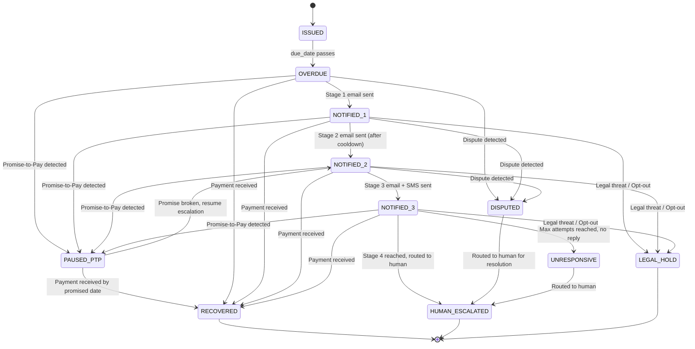

# RevenueGuard — Core Project Context

> **Project Name:** RevenueGuard — AI-Powered B2B Receivables Chaser + Promise-to-Pay Tracker  
> **Hackathon:** Razorpay AI Buildathon  
> **Track:** Track 03 — AI Revenue Recovery  
> **Tagline:** *Find revenue that's slipping away and win it back.*

---

## 1. The Problem Statement (Verbatim)

> *"Build an agent that detects revenue at risk, determines the right intervention, and executes a bounded recovery workflow: from payment failures and checkout abandonment to overdue receivables."*

### 1.1 Deconstructing the Problem Statement

Every phrase in the problem statement maps to a required capability in our system:

| Phrase | What It Means | What We Build |
|---|---|---|
| **"Build an agent"** | Not a dashboard or a script. An autonomous, LLM-powered system that can reason, decide, and act. | An AI Agent with an LLM core (GPT-4o / Claude 3.5 Sonnet) that processes context and takes actions. |
| **"detects revenue at risk"** | The system must have a trigger mechanism — a way to "see" when money is being lost. | An **Event Ingestion Layer** that monitors the invoice database for overdue statuses, incoming payment webhooks, and client email replies. |
| **"determines the right intervention"** | The agent must analyze the *context* of the failure (why is the money stuck?) and choose the *best* action, not a generic one. | An **AI Decision Engine** that uses an LLM to classify the situation (e.g., intent of a client's reply) and select from a menu of possible actions (send email, pause, escalate to human, grant extension). |
| **"executes a bounded recovery workflow"** | The agent must *do* the thing (send the email, trigger the API call) but within strict safety guardrails. It cannot spam, harass, or act outside defined limits. | A **Workflow Orchestrator / State Machine** with hardcoded compliance rules (max contact frequency, tone escalation limits, stopping conditions) that governs the agent's behavior. |
| **"from payment failures and checkout abandonment to overdue receivables"** | Defines the scope of use cases. We are choosing to focus exclusively on **overdue receivables** in the B2B context. | The entire system is architected around the lifecycle of a B2B invoice, from issuance to recovery or write-off. |

---

## 2. The Bar (Judging Criteria)

> *"Don't just identify the problem. Show measured money recovered across a batch, with compliant escalation, stopping rules, and an audit trail."*

This is the most critical section. "The Bar" is our rubric. Every feature we build must trace back to one of these four pillars. If a feature doesn't serve one of these pillars, we don't build it.

### 2.1 Pillar Breakdown

#### Pillar 1: Measured Money Recovered Across a Batch

- **What it means:** The judges don't want to see a single invoice being chased. They want to see a **simulation** where the agent processes a large batch of invoices (e.g., 100-500) and produces a quantifiable result: "Out of ₹1,00,00,000 in overdue receivables, the agent recovered ₹45,00,000 (45%) over a simulated 30-day period."
- **Why it matters:** This proves the system works at scale, not just in a cherry-picked demo.
- **How we implement it:**
  - Build a **Batch Simulation Engine**: A script that generates N fake invoices with varying amounts, overdue durations, and simulated client behaviors (some pay after first reminder, some dispute, some ghost, some promise to pay and follow through, some promise and don't).
  - Run the simulation at **accelerated speed** (30 simulated days in ~60 seconds) during the demo.
  - Display a **live-updating dashboard** showing:
    - Total At-Risk Revenue (the starting pool).
    - Total Recovered (climbing in real-time as invoices get "paid" in the simulation).
    - Recovery Rate (%).
    - Average Days to Recovery.
    - Cost Saved vs. Manual Follow-up (estimated).

#### Pillar 2: Compliant Escalation

- **What it means:** The agent's tone and urgency must increase over time, but in a controlled, predictable, and regulation-safe manner. It cannot jump from "Gentle Reminder" to "Legal Threat" overnight.
- **Why it matters:** This proves the AI is safe for enterprise deployment and won't damage client relationships.
- **How we implement it:**
  - Define a strict **Escalation Ladder** with timed stages:
    - **Stage 1 (Day 1-7 overdue):** Friendly Reminder. Tone: Warm, helpful. Channel: Email to `accounts@client.com`.
    - **Stage 2 (Day 8-15 overdue):** Firm Follow-up. Tone: Professional, direct. Channel: Email to direct contact + CC to account manager.
    - **Stage 3 (Day 16-30 overdue):** Urgent Notice. Tone: Serious, references contract terms. Channel: Email + SMS to point of contact.
    - **Stage 4 (Day 30+ overdue):** Final Notice / Human Escalation. Tone: Formal. Action: Drafts a final notice email AND triggers a Slack/Teams webhook to a human collections manager. The AI does NOT send the final notice autonomously — it requires human approval (Human-in-the-Loop).
  - **Frequency Limits (Hardcoded, Non-Negotiable):**
    - The agent CANNOT send more than 1 email per 4-day window to the same client for the same invoice.
    - The agent CANNOT send more than 1 SMS per 7-day window.
    - During the demo, we can show the agent *attempting* to send an email, checking the database, finding the last contact was 2 days ago, and **blocking itself**. This is a powerful visual for judges.

#### Pillar 3: Stopping Rules

- **What it means:** The agent must know when to STOP chasing. It cannot be a relentless collection bot.
- **Why it matters:** This is the single most important safety feature. It proves the AI is responsible.
- **How we implement it:**
  - **Stop Condition 1 — Payment Received:** If a payment webhook (or simulated payment event) is received for an invoice, the agent immediately cancels ALL pending follow-ups and marks the invoice as `RECOVERED`. No further action is taken.
  - **Stop Condition 2 — Promise to Pay (PTP):** If the client replies with a promise (e.g., "We will pay by Friday"), the LLM extracts the promised date. The agent pauses all automated emails until that date + a grace period (e.g., 2 business days). If payment arrives, it stops. If not, it resumes the escalation ladder from where it left off, referencing the broken promise.
  - **Stop Condition 3 — Dispute Detected:** If the client raises a legitimate dispute (e.g., "Wrong amount charged," "Service not delivered"), the agent IMMEDIATELY halts all collection activity. It flags the invoice as `DISPUTED`, logs the reason, and routes it to a human account manager via Slack/webhook. The AI does NOT attempt to negotiate a dispute.
  - **Stop Condition 4 — Opt-Out / Legal Threat:** If the client says "Stop contacting me" or "We are involving our legal team," the agent halts permanently and flags for human intervention. Status: `LEGAL_HOLD`.
  - **Stop Condition 5 — Max Attempts Reached:** If the agent has sent the maximum number of follow-ups (e.g., 5 emails + 2 SMS) without any response, it marks the invoice as `UNRESPONSIVE` and routes to human review. It does NOT continue indefinitely.

#### Pillar 4: Audit Trail

- **What it means:** Every single decision the agent makes must be logged, timestamped, and explainable. A human should be able to look at any invoice and understand exactly what happened, why, and when.
- **Why it matters:** Enterprise clients and regulators demand transparency. "The AI sent this email because..." is a fundamental requirement.
- **How we implement it:**
  - Every action generates an **Audit Log Entry** stored in the database with the following fields:
    - `timestamp`: When the action occurred.
    - `invoice_id`: Which invoice this relates to.
    - `event_type`: `EMAIL_SENT`, `EMAIL_RECEIVED`, `INTENT_CLASSIFIED`, `STATUS_CHANGED`, `ESCALATION_BLOCKED`, `HUMAN_ESCALATED`, `PAYMENT_RECEIVED`, `RULE_TRIGGERED`.
    - `agent_reasoning`: The LLM's analysis. (e.g., "Client email contains phrase 'will pay by Friday'. Classified as PROMISE_TO_PAY with 94% confidence.").
    - `rule_applied`: Which compliance rule governed the decision. (e.g., "Rule: Pause escalation on PTP intent. Grace period: promised_date + 2 business days.").
    - `action_taken`: What the agent actually did. (e.g., "Scheduled follow-up for Nov 17. All pending emails cancelled.").
    - `content_snapshot`: The actual email text sent or received (for full reproducibility).
  - **Dashboard UI:** A timeline/activity-feed view for each invoice showing this log in a human-readable format. This is the centrepiece of the demo.

---

## 3. The Chosen Direction & Why

### 3.1 Direction: B2B Receivables Chaser + Promise-to-Pay Tracker

We are combining two of the "Example Directions" from the problem statement into a single, cohesive product:

1. **B2B Receivables Chaser:** The agent monitors overdue B2B invoices and autonomously manages the follow-up process (drafting contextual emails, escalating tone, switching channels).
2. **Promise-to-Pay Tracker:** When a client replies with a commitment (e.g., "Paying next week"), the agent understands the natural language, extracts the date, pauses the workflow, and resumes intelligently if the promise is broken.

### 3.2 Why This Direction Was Chosen

| Criterion | Score | Reasoning |
|---|---|---|
| **Business Impact** | ★★★★★ | B2B receivables is a multi-billion dollar problem. Companies lose 5-10% of revenue to late payments. Manual follow-up is expensive and awkward. |
| **Technical "Wow" Factor** | ★★★★☆ | Using an LLM not just for text generation, but as an **intent classification engine** that drives a **state machine** is sophisticated and impressive. Adding the Promise-to-Pay NLU layer elevates it further. |
| **Demo-ability** | ★★★★★ | A dashboard with a live simulation, an escalating email sequence, and a transparent audit log tells a compelling visual story in under 3 minutes. |
| **Feasibility (No Voice/Audio)** | ★★★★★ | Relies entirely on standard web development skills: Backend APIs, database, LLM API calls, and a frontend dashboard. No voice, no audio, no complex real-time streaming. |
| **Alignment with "The Bar"** | ★★★★★ | Naturally and directly addresses all four pillars: batch recovery metrics, compliant escalation, stopping rules, and audit trail. |

### 3.3 Why Other Directions Were Deprioritized

- **Checkout Drop-off Recovery:** Too common. Rule-based abandoned cart emails have existed for a decade. Hard to differentiate with AI.
- **Hinglish Voice Recovery:** Extremely high "wow" factor but introduces significant technical risk (latency, STT/TTS complexity, API dependencies) that is dangerous in a time-constrained hackathon.
- **Failed-Subscription / Mandate Retry Sequencer:** High business value but entirely backend logic with no natural visual demo component. Harder to pitch.
- **Payment Degradation (Generic):** Too abstract to tell a specific, relatable story to judges.

---

## 4. Architectural Blueprint

The system is composed of three core layers and one simulation layer (for the hackathon demo).

### 4.1 Layer 1: Event Ingestion (The Trigger)

**Purpose:** Detect when revenue is at risk.

- **Invoice Monitor:** A scheduled job (cron / background task) that periodically scans the invoice database. Any invoice where `status == 'ISSUED'` and `due_date < today` is flagged as `OVERDUE` and pushed into the Agent's processing queue.
- **Payment Webhook Listener:** An API endpoint that receives payment confirmation events (simulated Razorpay `payment.captured` webhooks). When a payment is received, it immediately triggers **Stop Condition 1** (Payment Received).
- **Email Reply Listener:** An API endpoint (or a simulated inbox) that receives client replies to the agent's emails. These replies are passed to the AI Decision Engine for intent classification.

### 4.2 Layer 2: AI Decision Engine (The Brain)

**Purpose:** Analyze the context and determine the right intervention.

This is the core of the agent. It uses an LLM (via API) for two distinct tasks:

#### Task A: Intent Classification & Entity Extraction

When a client email reply is received, the LLM is prompted to analyze it and return a structured JSON response.

**Example LLM Prompt (System):**
```
You are an AI assistant specializing in B2B accounts receivable. Analyze the 
following email reply from a client regarding an overdue invoice. 

Classify the client's intent into EXACTLY ONE of the following categories:
- PROMISE_TO_PAY: Client commits to paying by a specific date.
- DISPUTE: Client raises an issue with the invoice amount, service, or delivery.
- NEED_EXTENSION: Client asks for more time without specifying a date.
- PARTIAL_PAYMENT: Client offers to pay a portion now and the rest later.
- ACKNOWLEDGMENT: Client acknowledges the invoice but provides no commitment.
- OPT_OUT: Client requests to stop being contacted.
- LEGAL_THREAT: Client mentions legal action or lawyers.
- UNRELATED: The reply is not relevant to the invoice.

Also extract the following entities if present:
- promised_date: The date the client commits to paying (ISO 8601 format).
- disputed_amount: The amount the client is disputing.
- partial_amount: The amount the client is offering to pay now.
- reason: A brief summary of the client's stated reason.

Respond ONLY in the following JSON format:
{
  "intent": "PROMISE_TO_PAY",
  "confidence": 0.94,
  "entities": {
    "promised_date": "2024-11-15",
    "reason": "Waiting for internal budget approval"
  },
  "summary": "Client acknowledges the overdue invoice and commits to payment by Nov 15, pending internal budget approval."
}
```

**Example Client Email (Input):**
> "Hi, thanks for the reminder. We're aware of the outstanding invoice. Our finance team is processing it and we expect to have the payment wired by next Friday. Apologies for the delay."

**Example LLM Output:**
```json
{
  "intent": "PROMISE_TO_PAY",
  "confidence": 0.95,
  "entities": {
    "promised_date": "2024-11-15",
    "reason": "Finance team processing, expected by next Friday"
  },
  "summary": "Client acknowledges the overdue invoice and promises payment by next Friday. Delay attributed to internal processing."
}
```

#### Task B: Contextual Email Drafting

When the agent decides to send an email, it uses the LLM to draft a message that is:
- **Context-aware:** References the specific invoice number, amount, due date, and any prior interactions.
- **Tone-appropriate:** Matches the current escalation stage (Gentle → Firm → Urgent → Final).
- **Personalized:** Adjusts formality based on the client profile (startup vs. enterprise).
- **Promise-aware:** If the client previously made a promise that was broken, the email explicitly (but professionally) references it.

**Example Contextual Drafting Prompt:**
```
You are drafting a follow-up email for an overdue B2B invoice.

Context:
- Invoice #: INV-2024-0847
- Client: Acme Corp (Enterprise, Fortune 500)
- Amount: ₹12,50,000
- Due Date: October 1, 2024
- Days Overdue: 22
- Escalation Stage: STAGE_2 (Firm Follow-up)
- Previous Interaction: Client promised to pay by Oct 15. Payment was NOT received.
- Contact: Rajesh Kumar, Finance Manager

Write a professional, firm email. Reference the broken promise from Oct 15. 
Do NOT threaten legal action. Keep it under 150 words. Include a direct 
payment link placeholder: {{payment_link}}.
```

### 4.3 Layer 3: Workflow Orchestrator / State Machine (The Action & Safety Net)

**Purpose:** Execute the intervention within strict boundaries.

Every invoice in the system exists in one of the following states at any given time:



**State Definitions:**

| State | Description | Agent Behavior |
|---|---|---|
| `ISSUED` | Invoice created, not yet due. | No action. Monitoring only. |
| `OVERDUE` | Due date has passed, no payment received. | Agent begins Stage 1 of escalation. |
| `NOTIFIED_1` | Stage 1 (Gentle Reminder) email sent. | Waiting for reply or cooldown to send Stage 2. |
| `NOTIFIED_2` | Stage 2 (Firm Follow-up) email sent. | Waiting for reply or cooldown to send Stage 3. |
| `NOTIFIED_3` | Stage 3 (Urgent Notice) email + SMS sent. | Waiting for reply or cooldown to escalate to human. |
| `PAUSED_PTP` | Client promised to pay. All automation paused. | Agent waits until `promised_date + grace_period`. If payment arrives, → `RECOVERED`. If not, resumes escalation from the next stage. |
| `DISPUTED` | Client raised a dispute. All automation halted. | Agent logs the dispute reason, notifies human manager via Slack/webhook. NO further automated contact. |
| `LEGAL_HOLD` | Client threatened legal action or opted out. | Agent permanently halts. Flags for legal/compliance review. |
| `UNRESPONSIVE` | Max contact attempts reached with zero reply. | Agent stops and routes to human for manual decision (write-off or phone call). |
| `RECOVERED` | Payment successfully received. | Terminal state. All pending actions cancelled. Invoice marked as recovered. |
| `HUMAN_ESCALATED` | Routed to a human team member for manual handling. | Terminal state for the AI. Human takes over. |

### 4.4 Layer 4: Simulation Engine (For Demo Only)

**Purpose:** Prove "measured money recovered across a batch" during the hackathon demo.

- **Data Generator:** A script that creates N invoices (e.g., 100) with randomized:
  - Amounts (₹10,000 to ₹50,00,000).
  - Overdue durations (1 to 60 days).
  - Client profiles (startup, SME, enterprise).
  - Simulated behaviors: 40% pay after first reminder, 15% promise and follow through, 10% promise and break it, 10% dispute, 5% ghost entirely, 10% pay after escalation, 5% need extension, 5% opt-out/legal.
- **Time Accelerator:** The simulation compresses 30 days into ~60-90 seconds, triggering the agent's state machine at each simulated "day."
- **Live Dashboard:** Real-time charts showing:
  - Recovery funnel (how many invoices are at each state).
  - Cumulative ₹ recovered over time.
  - Agent activity log (scrolling feed of actions taken).

---

## 5. Key Differentiators (How We Stand Out)

If other teams also pick the B2B Receivables direction, here is what makes our project superior:

### 5.1 Multi-Agent Architecture
We don't build one monolithic bot. We build two sub-agents:
- **Agent A — The Negotiator:** Reads client emails, classifies intent, drafts responses, decides on timing.
- **Agent B — The Compliance Officer:** Reviews every action proposed by Agent A against the rule engine. It has veto power. If Agent A wants to send an email but the cooldown hasn't passed, Agent B blocks it and logs the reason.

This separation of concerns is a sophisticated architectural pattern that demonstrates mature AI system design.

### 5.2 Promise-to-Pay Intelligence
Most teams will build a linear escalation pipeline. Ours is **non-linear and adaptive**. The Promise-to-Pay feature introduces branching logic:
- The LLM extracts a specific date from natural language ("end of next week" → Nov 15).
- The system creates a calendar-based trigger.
- If the promise is kept → recovery. If broken → the agent resumes with *increased context* ("As discussed in your previous email dated Nov 8, payment was expected by Nov 15...").

### 5.3 Human-in-the-Loop (HITL) Escalation
The agent knows its limits. For high-risk situations (disputes, legal threats, very high-value invoices above a configurable threshold), the agent does NOT act autonomously. It:
- Drafts a recommended action.
- Sends a notification to a human (via Slack webhook / in-app notification).
- Waits for human approval before proceeding.
This proves responsible AI deployment.

### 5.4 Transparent AI Reasoning (Explainability)
The audit trail doesn't just log *what* happened. It logs *why*. Every entry includes:
- The LLM's raw classification output (intent + confidence score).
- The specific rule that was triggered.
- The action that was taken (or blocked) as a result.
This level of transparency is rare and highly valued by enterprise judges.

---

## 6. Proposed Tech Stack

| Component | Technology | Rationale |
|---|---|---|
| **Backend API** | Python (FastAPI) | Fast to build, excellent async support, great LLM library ecosystem. |
| **AI / LLM** | OpenAI GPT-4o API (or Claude 3.5 Sonnet) | Best-in-class for intent classification and text generation. Structured JSON output mode. |
| **Database** | PostgreSQL (or SQLite for hackathon speed) | Relational DB for invoices, audit logs, and state tracking. |
| **Frontend Dashboard** | React (Next.js) or a lightweight alternative (Streamlit for speed) | For the Audit Trail UI, simulation dashboard, and recovery metrics. |
| **Notifications** | Slack Webhook API / Twilio (SMS) / SendGrid (Email) | For multi-channel escalation and human-in-the-loop alerts. |
| **Task Scheduling** | Celery + Redis (or APScheduler for simplicity) | For scheduling delayed follow-ups, promise-to-pay reminders, and the simulation engine. |

---

## 7. Demo Strategy (3-Minute Pitch)

### Minute 1: The Problem (30 sec) + Architecture (30 sec)
- "Indian businesses lose ₹X crore annually to late B2B payments. Manual follow-up is expensive, awkward, and inconsistent."
- Show a high-level architecture diagram (3 layers).

### Minute 2: Live Simulation (60 sec)
- Launch the Batch Simulation with 100 invoices.
- Show the dashboard updating in real-time:
  - Invoices moving through states.
  - Recovery amount climbing.
  - The agent drafting and sending emails.
  - A simulated client reply ("Will pay Friday") being classified as `PROMISE_TO_PAY` and the agent pausing.
  - Another simulated reply ("Wrong amount charged") triggering a `DISPUTE` stop and a Slack notification firing.

### Minute 3: The Audit Trail + Results (60 sec)
- Click into a specific invoice and show the full timeline: every email sent, every reply analyzed, every decision logged with the AI's reasoning.
- Show the final recovery metrics: "Out of ₹1,00,00,000 at risk, the agent recovered ₹47,30,000 (47.3%) in 30 simulated days, with zero compliance violations."

---

## 8. Core Principles & Guardrails

These are non-negotiable design principles for the project:

1. **Safety First:** The agent must never take an action that could damage a client relationship. When in doubt, it escalates to a human.
2. **Transparency Always:** Every action must be logged and explainable. No "black box" decisions.
3. **Bounded Autonomy:** The agent operates within strictly defined rules. It cannot override its own compliance rules, even if the LLM suggests doing so.
4. **Graceful Degradation:** If the LLM API is down or returns a low-confidence classification (< 70%), the agent does NOT guess. It flags the invoice for human review.
5. **Depth Over Breadth:** We solve one use case (B2B Receivables) exceptionally well, rather than attempting to cover multiple use cases poorly.

---

## 9. Success Metrics (What "Winning" Looks Like)

| Metric | Target |
|---|---|
| Recovery Rate (Simulated Batch) | > 40% of at-risk revenue recovered |
| False Positive Rate (Intent Classification) | < 5% misclassification on test data |
| Compliance Violations | 0 (no emails sent within cooldown, no contact after opt-out) |
| Audit Trail Completeness | 100% of agent actions logged with reasoning |
| Demo Smoothness | End-to-end simulation runs without manual intervention |
| Human Escalation Rate | 15-20% of invoices correctly routed to humans for edge cases |

---

## 10. Glossary

| Term | Definition |
|---|---|
| **PTP** | Promise-to-Pay. A client's commitment to pay by a specific date. |
| **HITL** | Human-in-the-Loop. A design pattern where the AI defers to a human for high-risk decisions. |
| **Stopping Rule** | A condition under which the agent permanently or temporarily halts all automated actions for a specific invoice. |
| **Escalation Ladder** | The predefined sequence of increasingly urgent communication stages. |
| **Cooldown** | The minimum time interval between consecutive contacts to the same client. |
| **Intent Classification** | The process of using an LLM to categorize a client's email reply into a predefined intent category. |
| **Bounded Workflow** | An automated process that operates within strict, predefined limits and cannot exceed its own authority. |
| **Audit Log** | A chronological record of every decision, action, and event in the system, designed for transparency and compliance. |

---

> [!IMPORTANT]
> This document is the **single source of truth** for the RevenueGuard project. All architectural decisions, feature scoping, and implementation priorities should reference this document. If a feature is not described here, it is out of scope for the hackathon.
